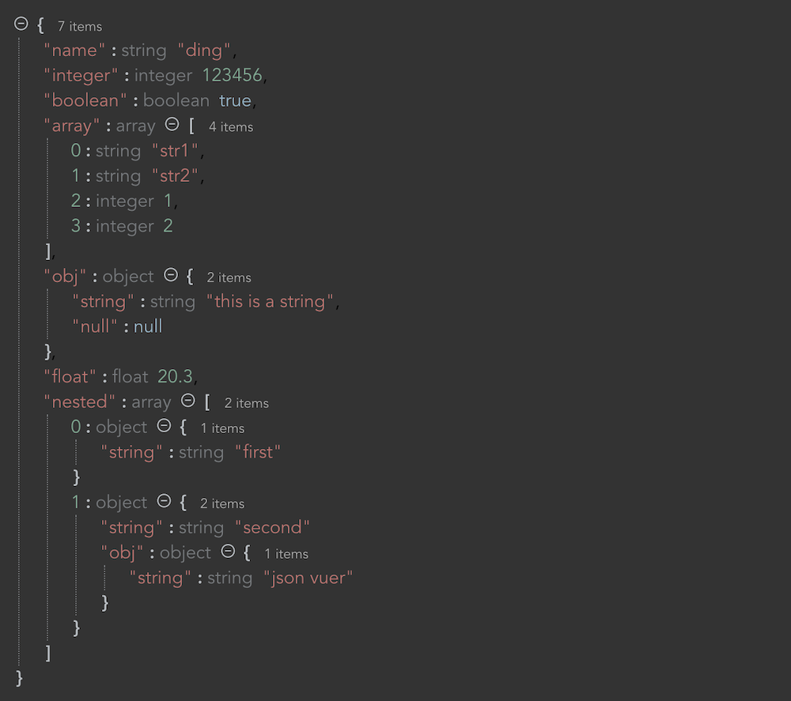

# json-vuer

vue 的 JSON 查看和编辑器组件

A json viewer and editor for vue


[English](./README_en.md)





- [json-vuer](#json-vuer)
  - [功能特性](#功能特性)
  - [安装说明](#安装说明)
  - [属性参数](#属性参数)
  - [个性主题](#个性主题)


## 功能特性

* 节点可展开/折叠
* key 可按字母排序
* JSON 编辑
* 可以展示 array 和 object 的 size
* 支持可自定义主题样式
* 可复制到粘贴板


## 安装说明

使用 npm:
```shell
npm install json-vuer --save
```

使用 yarn:
```shell
yarn add json-vuer
```

然后在 js 代码里，添加:
```javascript
import JsonVuer from "json-vuer"
Vue.use(JsonVuer)
```

最后在模版中使用
```html
<template>
    <div>
        <json-vuer :value="json" 
                   :indentWidth="4" 
                   :showObjectSize="true" 
                   :showDataTypes="true" 
                   :copyable="true"/>
    </div>
</template>
```


## 属性参数

| Name           | Type                    | Default | Description                                                  |
| -------------- | ----------------------- | ------- | ------------------------------------------------------------ |
| value          | JSON                    | null    | 可以是任何有效的 json： object, array, string 等等       |
| v-model        | JSON                    |         |                                                              |
| name           | string \| false \| null | empty   | 根节点的名称. 可为 null/false/空字符串 |
| indentWidth    | integer                 | 4       | 缩进       |
| showObjectSize | boolean                 | true    | 是否显示 object/array 的大小                   |
| objectSizeName | string                  | items   | “size” 显示的名称                                      |
| showArrayIndex | boolean                 | true    | 是否展示 array 的 index                             |
| showDataTypes  | boolean                 | true    | 是否展示数据类型                              |
| showComma      | boolean                 | true    | 是否显示逗号                                  |
| theme          | string                  | default | 内置的主题有: "default", "night", "iron-man", "greenscreen"。你可以完全自定义主题样式 [参看](#个性主题) . |
| iconStyle      | string                  | circle  | 折叠/展开的图标. 可以是："circle", triangle", "square", "chevron". |
| copyable       | boolean                 | true    | 设置是否可以复制      |
| addable        | boolean                 | false   | 设置是否可以添加节点     |
| editable       | boolean                 | false   | 设置是否可以编辑 |
| removable      | boolean                 | false   | 设置是否可以删除         |
| sort           | boolean                 | false   | 设置是否对 key 排序                              |


## 个性主题

只需两步，就可以自定义一个主题

1. 按照如下模版自定义 **SCSS**
2. 将 `theme="my-theme"` 添加到 `JsonVuer` 组件

```scss
.json-vuer.my-theme { // 自定你的主题名称
    background-color: #fff;
    
    .json-name {
        color: #000;
        &.array-index { color: #0000FF; }
    }

    .json-value { // 设置不同类型 value 的显示样式
        &__object {
            margin-left: 4px;
            .fold-line { border-left: 1px dotted #aaa; }
        }

        &__string { color: #FF0000; }
        &__boolean { color: #0000FF; }
      
        &__integer,
        &__float { color: rgb(47, 100, 71);}
      
        &__null,
        &__undefined,
        &__nan {
            box-sizing: border-box;
            padding: 0 4px;
            border-radius: 4px;
            color: #0000FF;
            background-color: #0000;
            font-size: 11px;
        }
    }

    .json-braces { // 设置“括号”的显示样式
        &__start {}
        &__end {}
        &__object {}
        &__array {}
    }

  	.json-comma,
    .json-quotes { color: #000; } // 设置逗号、引号样式

    .json-colon { // 设置冒号样式
        margin: 0 4px;
        color: #000;
        font-weight: bold;
    }

    .json-data-type-label { // 设置数据类型标签样式
        color: #aaa;
        margin-right: 8px;
    }

    .json-toggle { // 设置“折叠/展开” 样式
        padding: 0 8px 0 0;
        color: #000;
        font-size: 13px;

        &__collapsed {}
	    &__expanded {}
    }

    .json-ellipsis { // 设置省略号样式
        color: #000;
        font-weight: bold;
        padding: 0 5px;
    }

    .json-object-size { // 设置 object/array size 显示标签的样式
        color: #aaa;
        font-size: 12px;
        margin-left: 8px;
    }

    .json-node-toolbar { // 设置节点工具栏样式
        margin-left: 4px;
        color: #000;
        font-size: 14px;
    }
}

```

